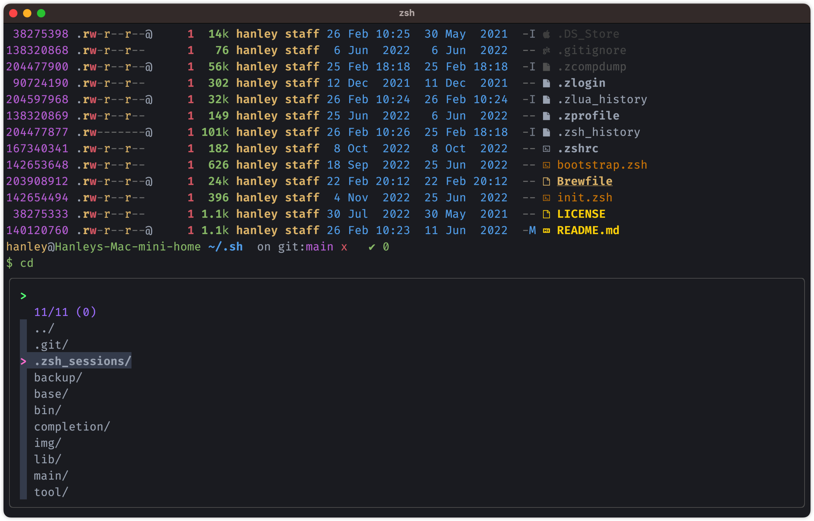

# dotzsh

My shell(zsh) configuration

## What is this repository for?

You can visit my configuration for **inspiration**!

## How I use it?

1. Clone this repo to local dir: `$HOME/.zsh`: `git clone https://github.com/hanleylee/dotzsh.git $HOME/.zsh`
2. Put a `$HOME/.zshenv` file and set contents of to it as below:

    ```zsh
    export ZDOTDIR=$HOME/.zsh
    ```

## Dependency

- package-manager: [zinit](https://github.com/zdharma-continuum/zinit)
- fuzzy finder: [fzf](https://github.com/junegunn/fzf)
- terminal: [kitty](https://github.com/kovidgoyal/kitty)
- font: [FiraCode Nerd Font](https://github.com/ryanoasis/nerd-fonts/tree/master/patched-fonts/FiraCode)

## Preview




## Ref

- [search-and-view](https://github.com/lilydjwg/search-and-view)

## License

All codes in this warehouse are distributed and used based on [MIT](https://mit-license.org). For the full text of
the agreement, see [LICENSE](https://github.com/hanleylee/dotzsh/blob/main/LICENSE) file.

Copyright 2023 HanleyLee

---

Welcome, if you have any bugs, I hope to raise issues. If it is useful to you, please mark a star ⭐️
