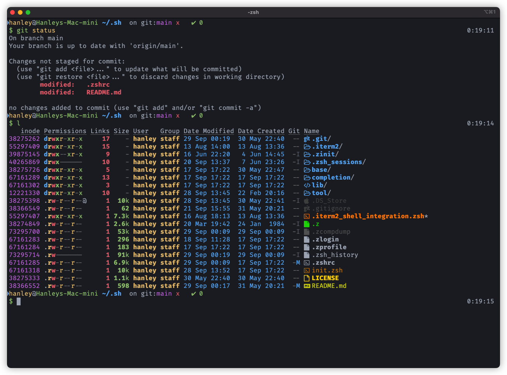

# dotsh

My shell(zsh) configuration

## What is this repository for?

You can visit my configuration for **inspiration**!

## How I use it?

1. Clone this repo to local dir: `$HOME/.sh`
2. Put a `$HOME/.zshenv` file and set contents of to it as below:

```zsh
export ZDOTDIR=$HOME/.sh/
```

## Dependency

- package-manager: [zinit](https://github.com/zdharma-continuum/zinit)
- fuzzy finder: [fzf](https://github.com/junegunn/fzf)
- terminal: [iterm2](https://github.com/gnachman/iTerm2)
- font: [Yahei-Fira-Icon-Hybrid-Font](https://github.com/hanleylee/yahei-fira-icon-hybrid-font)
- os: MacOS

## Preview


